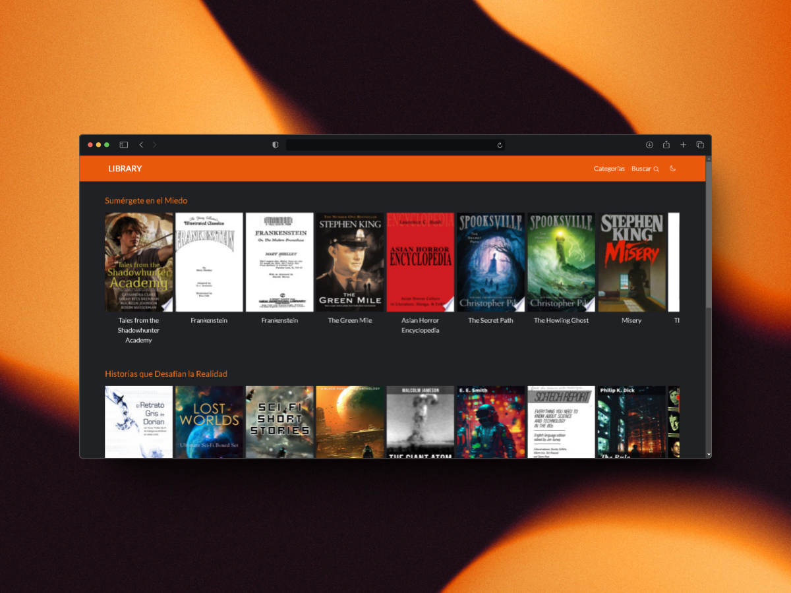

# Library
Library is a web application for searching and exploring books. It uses the Google Books API to provide detailed information on a wide range of genres and categories of books. This application is built with React, TypeScript, and Tailwind CSS, using React Router for navigation and Axios for HTTPS requests.

## Features
- Book Search: Find books by genre, title, author, or ISBN using the Google Books API.
- Book Categories: Explore books organized into various genres and subcategories.
- Book Details: Get detailed information about each book, including title, author, description, and more.
- Intuitive Interface: A user-friendly and responsive interface, built with Tailwind CSS for an optimal user experience.
- Dark/Light Themes: Switch between dark and light themes for comfortable viewing in any environment.

## Technologies Used
- React: Library for building user interfaces.
- TypeScript: Superset of JavaScript that adds static types.
- Tailwind CSS: CSS framework for rapid and efficient design.
- React Router: Library for routing in React applications.
- Axios: HTTP client for making requests to the Google Books API.

## Contribution
Contributions are welcome! If you want to contribute, please follow these steps:

### Fork the repository.
- Create a new branch (git checkout -b feature/new-feature).
- Make your changes and commit them (git commit -am 'feat: add a new feature').
- Push the branch (git push origin feature/new-feature).
- Open a Pull Request.
